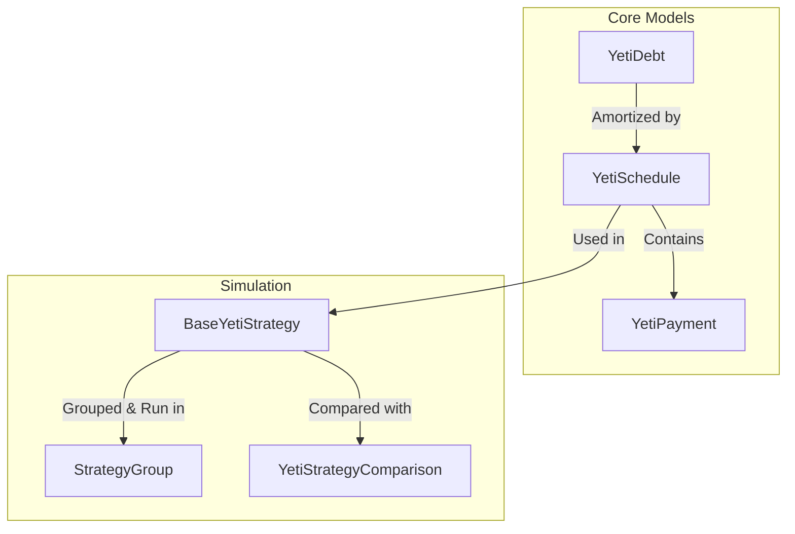

# @yeti/snowball

`@yeti/snowball` is a high-performance debt amortization and payoff simulation engine. It allows developers to model complex debt portfolios, simulate payment strategies (such as the classic **Debt Snowball** and **Debt Avalanche**), and compare the cost and time savings of different payoff methods.

---

## Features

- **Amortization Engine**: Accurately computes monthly interest accrual, principal reduction, and payoff durations.
- **7 Built-in Payoff Strategies**:
  - **Debt Avalanche** (`highestRate`): Mathematically optimal; minimizes total interest paid.
  - **Debt Snowball** (`lowestBalance`): Optimizes for psychological momentum by clearing small balances first.
  - **Balance/Payment Ratio** (`balancePaymentRatio`): Prioritizes debts based on cash flow efficiency.
  - **Balance/Rate Ratio** (`balanceRateRatio`): Prioritizes based on balance-to-rate efficiency.
  - **Highest Balance First** (`highestBalance`).
  - **Lowest Rate First** (`lowestRate`).
  - **Minimum Payments Only** (`minimumPayment`).
- **Rollover & Acceleration**: Automatically rolls over excess payments from paid-off debts to the next prioritized debt. Supports modeling extra monthly budget (acceleration).
- **Comparison Suite**: Quantifies interest, principal, and time differences between strategies.
- **Robust Model Validation**: Automatic minimum payment correction to guarantee payments cover at least the monthly interest (preventing negative amortization).

---

## Installation

Within the Yeti monorepo:

```bash
# Add as a dependency to your app/package
yarn add @yeti/snowball
```

Or reference it in your monorepo workspace dependencies:

```json
"dependencies": {
  "@yeti/snowball": "workspace:*"
}
```

---

## Core Architecture

The package is built on three core pillars:



### 1. Core Models
* **`YetiDebt`**: Represents a single debt obligation. It encapsulates properties like the current outstanding balance (`borrowed`), annual interest rate percentage (`rate`), and required minimum payment. Its setter properties automatically prevent negative values and validate that the minimum payment is sufficient to cover the accrued monthly interest.
* **`YetiPayment`**: A simple structure representing the division of a single monthly payment into `principal` and `interest`.
* **`YetiSchedule`**: Tracks the month-by-month state of an active debt during the simulation. It handles monthly interest calculations and accepts extra payments, returning any rollover funds (overpayments) when the debt is fully cleared.

### 2. Payoff Strategies
Strategies inherit from `BaseYetiStrategy` and orchestrate the prioritization and payment process:
* **Sorting Phase**: Prior to simulation, debts are sorted using the strategy's specific criteria (e.g. rate descending for Avalanche, balance ascending for Snowball).
* **Payment Loop**: Month-by-month, the engine calculates the sum of all minimum payments. It subtracts this sum from the user's total monthly budget to determine the available extra cash.
* **Rollover Distribution**: The extra cash is applied to the highest-priority unpaid debt. If that debt is paid off, the remaining funds roll over to the next prioritized debt in the same month.

### 3. Comparison & Grouping
* **`YetiStrategyComparison`**: Calculates the mathematical difference between a base strategy and a target strategy, exposing savings in total interest paid and months to pay off.
* **`StrategyGroup`**: Runs all strategies in parallel against the same debt portfolio, facilitating quick side-by-side comparison and testing extra payment configurations.

---

## Quickstart Guide

### 1. Simulating a Single Strategy
Here is how to set up a portfolio of debts and simulate the **Debt Avalanche** strategy:

```typescript
import { YetiDebt, HighestRateYetiStrategy } from "@yeti/snowball";

// 1. Define your debts
const debts = [
  new YetiDebt(5000, 18.9, 150, "Credit Card A"), // balance, rate (%), minPayment, unique identifier
  new YetiDebt(12000, 4.5, 250, "Car Loan"),
  new YetiDebt(1500, 12.0, 50, "Store Card")
];

// 2. Define your total monthly payment budget (must be >= sum of minimum payments)
const monthlyBudget = 600; 

// 3. Execute the Avalanche Strategy (Highest Rate First)
const avalanche = new HighestRateYetiStrategy(debts, monthlyBudget);

// 4. Output the results
console.log(`--- Avalanche payoff results ---`);
console.log(`Total Months: ${avalanche.months}`);
console.log(`Total Interest Paid: $${avalanche.interest}`);
console.log(`Total Cost: $${avalanche.total}`);

// 5. Inspect individual payment schedules
for (const schedule of avalanche.schedules) {
  console.log(`\nDebt: ${schedule.debt.uid}`);
  console.log(`  Months to payoff: ${schedule.months}`);
  console.log(`  Interest paid: $${schedule.interest}`);
}
```

### 2. Comparing Strategies side-by-side using `StrategyGroup`
Using `StrategyGroup` simplifies comparing multiple strategies and evaluating how extra monthly payments (acceleration) impact the payoff timeline.

```typescript
import { StrategyGroup, strategies, YetiDebt } from "@yeti/snowball";

const debts = [
  new YetiDebt(5000, 18.9, 150, "Credit Card A"),
  new YetiDebt(12000, 4.5, 250, "Car Loan"),
  new YetiDebt(1500, 12.0, 50, "Store Card")
];

const baselineBudget = 450; // Total minimum payment sum is $450

// 1. Run all strategies in parallel using StrategyGroup
const group = new StrategyGroup(
  strategies,            // Registry of strategies to evaluate
  "minimumPayment",      // Key of the base strategy for comparisons
  debts,
  baselineBudget
);

// 2. Compare Snowball vs. Minimum Payments
const snowballComparison = group.compare("lowestBalance");
console.log(`\n--- Snowball vs Minimum Payments ---`);
console.log(`Interest Saved: $${Math.abs(snowballComparison.interest)}`);
console.log(`Time Saved: ${Math.abs(snowballComparison.months)} months`);

// 3. Compare Avalanche vs. Minimum Payments
const avalancheComparison = group.compare("highestRate");
console.log(`\n--- Avalanche vs Minimum Payments ---`);
console.log(`Interest Saved: $${Math.abs(avalancheComparison.interest)}`);
console.log(`Time Saved: ${Math.abs(avalancheComparison.months)} months`);

// 4. Accelerate payoff with an extra $150/month using Avalanche
const acceleratedAvalanche = group.accelerate("highestRate", 150);
console.log(`\n--- Accelerated Avalanche (+$150/mo) ---`);
console.log(`New Payoff Duration: ${acceleratedAvalanche.months} months`);
console.log(`New Total Interest: $${acceleratedAvalanche.interest}`);
```

---

## API Reference

### `YetiDebt`
Data structure representing a single debt account.

#### Constructor
`constructor(borrowed: number, rate: number, minimumPayment: number, uid?: string)`

#### Properties
- `borrowed`: Current balance. Throws error if set to negative.
- `rate`: Annual interest rate (0 to 100). Throws error if out of bounds.
- `minimumPayment`: Monthly minimum. Setters enforce that it is at least interest-only.
- `uid`: Unique identifier (auto-generates UUID if not provided).
- `interestOnlyPayment` *(readonly)*: The minimum payment required to cover interest only.

#### Static Methods
- `calcMinimumPayment(borrowed: number, rate: number, balanceRate?: number)`: Calculates minimum payment.
- `randomDebt()`: Generates a random valid debt.
- `fromExport(exportedData: any)`: Reconstructs a `YetiDebt` instance from plain JSON.

---

### `BaseYetiStrategy`
The foundation class for simulating debt repayment schedules. All specific strategy classes inherit from `BaseYetiStrategy`.

#### Properties
- `months` *(readonly)*: Total months until all debts are paid off.
- `interest` *(readonly)*: Total interest paid across all debts.
- `principal` *(readonly)*: Total principal paid.
- `total` *(readonly)*: Combined total cost (principal + interest).
- `schedules`: Array of `YetiScheduleInfo` containing detailed monthly payment traces.

---

### `YetiStrategyComparison`
Calculates delta metrics between a baseline strategy and a target strategy.

#### Properties
- `interest`: Target interest minus base interest.
- `months`: Target months minus base months.
- `total`: Target total cost minus base total cost.

---

### `StrategyGroup`
Utility for managing and comparing multiple strategies concurrently.

#### Methods
- `compare(strategyKey: string): YetiStrategyComparison`: Compares target strategy with the configured base strategy.
- `accelerate(strategyKey: string, extra: number): BaseYetiStrategy`: Re-runs a strategy with an increased monthly budget (adds `extra` budget).
